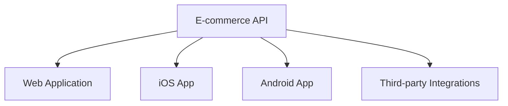

# Understanding APIs (Application Programming Interfaces)

## Table of Contents
- [Introduction](#introduction)
- [What is an API?](#what-is-an-api)
- [How APIs Work](#how-apis-work)
- [Real-World Examples](#real-world-examples)
- [Benefits of Using APIs](#benefits-of-using-apis)

## Introduction

An API (Application Programming Interface) serves as a bridge between different applications, enabling them to communicate and share data efficiently. Think of it as a digital contract that defines how two applications should interact with each other.

## What is an API?

An API is:
- A contract between applications
- An interface for data transfer
- A standardized way of communication
- A middleware that handles requests and responses

## How APIs Work

Consider this restaurant analogy:
- **Customer (Client)** - Places an order
- **Waiter (API)** - Takes the order to the kitchen
- **Kitchen (Server)** - Processes the order
- **Waiter (API)** - Delivers the finished order back to the customer

| Component | Role | Example |
|-----------|------|---------|
| Client | Sends requests | Mobile app, website, desktop application |
| API | Handles communication | RESTful endpoints, GraphQL interface |
| Server | Processes requests | Database operations, business logic |

## Real-World Examples

### Sports Results Application
1. Central API stores match results
2. Multiple platforms consume the data:
   - Web browsers
   - Mobile applications
   - Digital displays
3. Real-time updates through API calls

### E-commerce Platform

## Benefits of Using APIs

1. **Efficiency**
   - Single codebase for core functionality
   - Reduced development time
   - Easier maintenance

2. **Consistency**
   - Uniform data delivery
   - Standardized communication
   - Reliable integration points

3. **Scalability**
   - Easy to add new clients
   - Centralized updates
   - Platform independence

4. **Development Benefits**
   - Separation of concerns
   - Modular architecture
   - Simplified debugging

## Comparison: Traditional vs API-Based Architecture

| Aspect | Traditional Approach | API-Based Approach |
|--------|---------------------|-------------------|
| Code Management | Multiple codebases | Single codebase |
| Updates | Need to update each platform | Update once at API level |
| Integration | Complex, platform-specific | Standardized across platforms |
| Maintenance | Higher effort | Lower effort |
| Scalability | Limited | Highly scalable |

## Best Practices

1. **Documentation**
   - Clear endpoints description
   - Request/response examples
   - Error handling guidelines

2. **Security**
   - Authentication
   - Authorization
   - Data encryption

3. **Performance**
   - Caching strategies
   - Rate limiting
   - Response optimization

---

This documentation provides a comprehensive overview of APIs, their functionality, and benefits. For technical specifications and implementation details, please refer to the specific API documentation of your chosen framework or platform.
