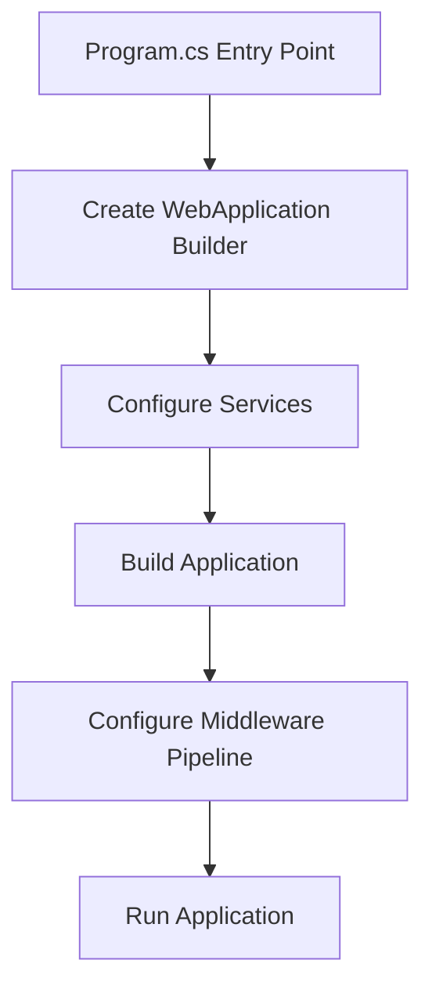
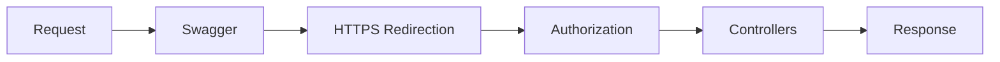

# Understanding APIs (Application Programming Interfaces)

## Table of Contents
- [Introduction](#introduction)
- [What is an API?](#what-is-an-api)
- [How APIs Work](#how-apis-work)
- [Real-World Examples](#real-world-examples)
- [Benefits of Using APIs](#benefits-of-using-apis)

## Introduction

An API (Application Programming Interface) serves as a bridge between different applications, enabling them to communicate and share data efficiently. Think of it as a digital contract that defines how two applications should interact with each other.

## What is an API?


An API is:
- A contract between applications
- An interface for data transfer
- A standardized way of communication
- A middleware that handles requests and responses

## How APIs Work

Consider this restaurant analogy:
- **Customer (Client)** - Places an order
- **Waiter (API)** - Takes the order to the kitchen
- **Kitchen (Server)** - Processes the order
- **Waiter (API)** - Delivers the finished order back to the customer

| Component | Role | Example |
|-----------|------|---------|
| Client | Sends requests | Mobile app, website, desktop application |
| API | Handles communication | RESTful endpoints, GraphQL interface |
| Server | Processes requests | Database operations, business logic |

## Real-World Examples

### Sports Results Application
1. Central API stores match results
2. Multiple platforms consume the data:
   - Web browsers
   - Mobile applications
   - Digital displays
3. Real-time updates through API calls

### E-commerce Platform


## Benefits of Using APIs

1. **Efficiency**
   - Single codebase for core functionality
   - Reduced development time
   - Easier maintenance

2. **Consistency**
   - Uniform data delivery
   - Standardized communication
   - Reliable integration points

3. **Scalability**
   - Easy to add new clients
   - Centralized updates
   - Platform independence

4. **Development Benefits**
   - Separation of concerns
   - Modular architecture
   - Simplified debugging

## Comparison: Traditional vs API-Based Architecture

| Aspect | Traditional Approach | API-Based Approach |
|--------|---------------------|-------------------|
| Code Management | Multiple codebases | Single codebase |
| Updates | Need to update each platform | Update once at API level |
| Integration | Complex, platform-specific | Standardized across platforms |
| Maintenance | Higher effort | Lower effort |
| Scalability | Limited | Highly scalable |

## Best Practices

1. **Documentation**
   - Clear endpoints description
   - Request/response examples
   - Error handling guidelines

2. **Security**
   - Authentication
   - Authorization
   - Data encryption

3. **Performance**
   - Caching strategies
   - Rate limiting
   - Response optimization

---

This documentation provides a comprehensive overview of APIs, their functionality, and benefits. For technical specifications and implementation details, please refer to the specific API documentation of your chosen framework or platform.


# Creating ASP.NET Core Web API Project
## Setting up SurveyBasket Solution

### Step 1: Create New Project
1. Open Visual Studio
2. Click "Create a new project"
3. Search and select "ASP.NET Core Web API"

### Step 2: Configure Project Settings


### Step 3: Configure Additional Settings
| Setting | Value | Description |
|---------|-------|-------------|
| Framework | .NET Core | The target framework for the application |
| Authentication | None | No authentication scheme selected initially |
| HTTPS | ✓ Checked | Configure HTTPS for secure communication |
| OpenAPI/Swagger | ✓ Checked | Enable API documentation and testing |
| Controllers | ✓ Checked | Use controller-based API endpoints |

### Project Structure Overview
```
SurveyBasket/
├── SurveyBasket.sln
└── SurveyBasket.Api/
    ├── Controllers/
    ├── Properties/
    ├── appsettings.json
    ├── appsettings.Development.json
    ├── Program.cs
    └── WeatherForecast.cs
```

## Key Components
1. **Controllers folder**: Contains API endpoint definitions
2. **Program.cs**: Application entry point and configuration
3. **appsettings.json**: Application configuration files
4. **WeatherForecast.cs**: Example model class

## Next Steps
1. Add necessary NuGet packages
2. Configure application settings
3. Create models and controllers
4. Set up database connectivity
5. Implement business logic

---
**Note**: The created project includes a sample WeatherForecast controller and model which can be used as reference or removed as needed.


# ASP.NET Core Web API Project Structure

## Solution Overview


## Project Components

### Dependencies
1. **Packages**
   - NuGet packages (e.g., Swagger)
   - Third-party libraries
   
2. **Project References**
   - References to other project layers
   - External project dependencies

### Project Structure
```
SurveyBasket.Api/
├── Properties/
│   └── launchSettings.json
├── Controllers/
├── appsettings.json
├── appsettings.Development.json
├── Program.cs
└── WeatherForecast.cs
```

## Launch Settings Configuration

### launchSettings.json
This file is **development-only** and not included in deployment.

```json
{
  "profiles": {
    "http": {
      "commandName": "Project",
      "launchBrowser": true,
      "launchUrl": "swagger",
      "environmentVariables": {
        "ASPNETCORE_ENVIRONMENT": "Development"
      },
      "applicationUrl": "http://localhost:5000"
    },
    "https": {
      "commandName": "Project",
      "launchBrowser": true,
      "launchUrl": "swagger",
      "environmentVariables": {
        "ASPNETCORE_ENVIRONMENT": "Development"
      },
      "applicationUrl": "https://localhost:5001;http://localhost:5000"
    },
    "IIS Express": {
      "commandName": "IISExpress",
      "launchBrowser": true,
      "launchUrl": "swagger"
    }
  }
}
```

### Profile Types

| Profile | Description | URL Configuration |
|---------|-------------|-------------------|
| HTTP | Basic HTTP profile | Single HTTP URL |
| HTTPS | Secure HTTPS profile | HTTPS URL with HTTP redirect |
| IIS Express | IIS-specific configuration | Uses IIS Settings with HTTPS redirect |

### Key Settings Explained
1. **Launch Browser**
   - `"launchBrowser": true` - Opens browser automatically
   - `"launchUrl": "swagger"` - Opens Swagger UI

2. **Environment Variables**
   - Development-specific settings
   - Configuration for local development

3. **Application URLs**
   - HTTP: Single port configuration
   - HTTPS: Dual ports with redirect
   - IIS Express: Custom IIS configuration

### Development vs. Deployment


| Environment | Configuration Source |
|-------------|---------------------|
| Development | launchSettings.json |
| Production | Server Configuration |

## Running the Application
1. Select desired profile from Visual Studio
2. Application launches with:
   - Command window showing port information
   - Browser opening to Swagger UI
   - HTTPS redirect if configured

---
**Note**: The launchSettings.json file is crucial for development but never deployed to production, where server configurations take precedence.

# Program.cs - Application Entry Point

## Overview
The Program.cs file serves as the entry point for ASP.NET Core Web API applications. It's where the application bootstrapping and configuration occur.

## Application Setup Flow


## Key Components

### 1. Builder Configuration
```csharp
var builder = WebApplication.CreateBuilder(args);
```
Think of this as assembling a car:
- The builder is like the car chassis
- Services are like car components:
  - Essential components (like engine) = Core services
  - Optional features (like AC) = Additional services

#### Service Registration
```csharp
// Essential Services
builder.Services.AddControllers();

// Additional Features
builder.Services.AddEndpointsApiExplorer();
builder.Services.AddSwaggerGen();
```

| Service Type | Purpose | Analogy |
|-------------|---------|---------|
| AddControllers | Enable API controllers | Car engine (essential) |
| AddSwaggerGen | API documentation | Car manual (optional) |
| AddEndpointsApiExplorer | API endpoint discovery | Navigation system (optional) |

### 2. Application Building
```csharp
var app = builder.Build();
```
This step finalizes the service configuration and prepares the application for middleware setup.

### 3. Middleware Pipeline


#### Development-Specific Middleware
```csharp
if (app.Environment.IsDevelopment())
{
    app.UseSwagger();
    app.UseSwaggerUI();
}
```
- Checks environment (configured in launchSettings.json)
- Enables Swagger only in development environment
- Security measure for production

#### Common Middleware Components
| Middleware | Purpose |
|------------|---------|
| UseSwagger | API documentation interface |
| UseHttpsRedirection | Secure communication |
| UseAuthorization | Security and access control |
| MapControllers | Route handling |

### 4. Application Launch
```csharp
app.Run();
```
Starts the web application and begins listening for requests.

## Complete Program.cs Structure
```csharp
var builder = WebApplication.CreateBuilder(args);

// Service Configuration
builder.Services.AddControllers();
builder.Services.AddEndpointsApiExplorer();
builder.Services.AddSwaggerGen();

// Build Application
var app = builder.Build();

// Middleware Pipeline
if (app.Environment.IsDevelopment())
{
    app.UseSwagger();
    app.UseSwaggerUI();
}

app.UseHttpsRedirection();
app.UseAuthorization();
app.MapControllers();

// Launch Application
app.Run();
```

## Key Concepts
1. **Service Configuration**: 
   - Occurs before application building
   - Defines available services and features

2. **Middleware Pipeline**:
   - Handles request processing
   - Executes in sequential order
   - Environment-specific configurations

3. **Environment Awareness**:
   - Development vs Production settings
   - Conditional feature enabling
   - Security considerations

---
**Note**: Understanding the Program.cs structure is crucial as it defines how your application bootstraps, what services are available, and how requests are processed.
